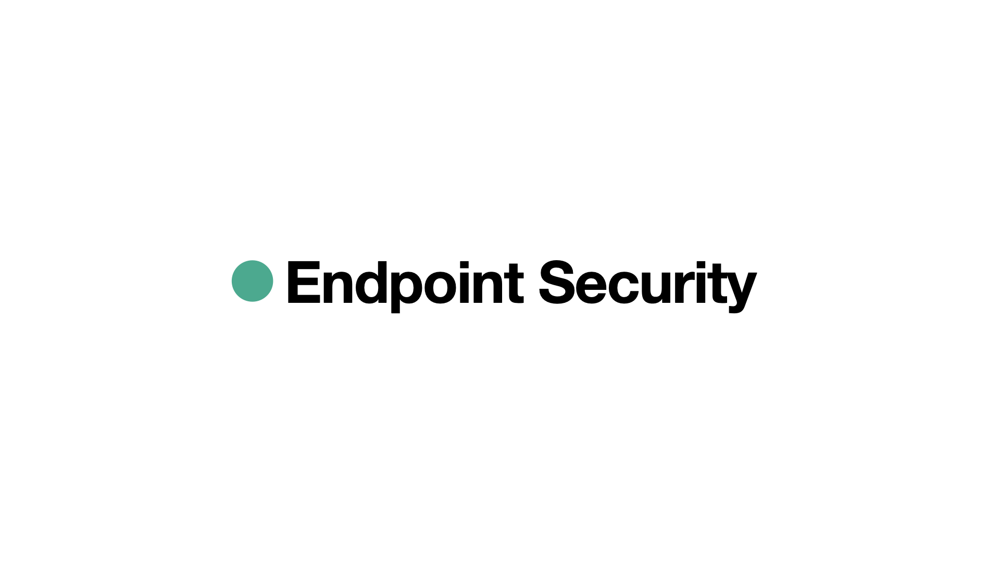

---
# Feel free to add content and custom Front Matter to this file.
# To modify the layout, see https://jekyllrb.com/docs/themes/#overriding-theme-defaults

layout: default
---

# Endpoint Security: Air-Gap Protection for Remote Work

{: .highlight-title }

> **Air-Gap Protection for Remote Work**
>
> We deliver the ultimate air-gap security for remote endpoints by ensuring data is only decrypted at the user’s eye level.

## The Problem

Endpoint devices are increasingly vulnerable—hackers can compromise them even when standard security measures are in place. As remote work spreads, the risk of data leakage at the “moment of use” grows. Many organizations either risk data exposure for convenience or adopt strict, productivity-limiting policies like full air-gapping.

## Our Solution

Our patented **augmented reality (AR) glasses** provide ultimate air-gap security without sacrificing the flexibility of remote work. Data stays encrypted (“in motion”) until it reaches our specialized AR glasses. Even on the user’s laptop or smartphone, the data remains unreadable—only becoming clear in front of the wearer’s eyes. This approach thwarts endpoint-based attacks since no plain-text data is ever exposed to the operating system or network. Even if an attacker has full control of the user’s laptop or smartphone, the sensitive document they’re viewing remains encrypted for the attacker.

## How It Works

As the user views the data through the AR glasses, decryption happens optically, directly in front of the user’s eye. The laptop or smartphone screen acts as a _canvas_, displaying encrypted data that only the AR glasses can interpret.

The AR glasses are disconnected from the network, creating an “air-gap” scenario where data only becomes usable at the final step—at the user’s eye level. The user wears the AR glasses while working on their laptop or smartphone. The screen shows encrypted output, but the AR overlay decrypts it in real time for the wearer.

We generate unique encryption keys using each user’s biometric data, ensuring that only the rightful wearer of the AR glasses can decrypt and view the content. Even if the AR glasses are stolen, the data remains secure due to the personalized, biometric-based key generation.

**Endpoint Security tackles the growing challenge of securing data in a remote work world.** It brings air-gap-level protection to everyday endpoints without sacrificing mobility or convenience. By decrypting data only within an isolated AR device, we ensure information stays safe from threats while enabling the flexibility modern organizations demand.

## About Us

### Lior Shalev

<a href="https://www.linkedin.com/in/liorshalev/" target="_blank">https://www.linkedin.com/in/liorshalev/</a>

Lior is a software developer with extensive experience designing and delivering high-performance, cross-platform solutions on Windows, Linux, Android, iOS, and cloud environments. Adept at building robust software pipelines and leading teams. Recognized for driving innovation in cybersecurity, large-scale distributed systems, and embedded software projects.

### Dr. Orna Yehuda Abramson

<a href="https://www.linkedin.com/in/droya/" target="_blank">https://www.linkedin.com/in/droya/</a>

Dr. Orna Yehuda Abramson is an experienced startup professional, innovation researcher, and development consultant. With a background in cognitive & behavioral psychology and data-driven strategy, she specializes in applying cognitive and behavioral science to cybersecurity challenges, enhancing user security awareness, and driving innovative solutions in the industry.

### Roy Melzer

<a href="https://www.linkedin.com/in/roymelzer/" target="_blank">https://www.linkedin.com/in/roymelzer/</a>

Roy Melzer is a seasoned Patent Portfolio Manager, IP Consultant, and Patent Leader. He specializes in protecting innovation, optimizing patent portfolios, and ensuring a strong competitive edge. His strategic insights help drive our IP roadmap, safeguard our technology, and enhance market positioning.

## Join Us!

Join us in redefining endpoint security for a remote-first world—secure data where it truly matters: at the user’s eye level.

[info@endpoint-sec.com](mailto:info@endpoint-sec.com)

